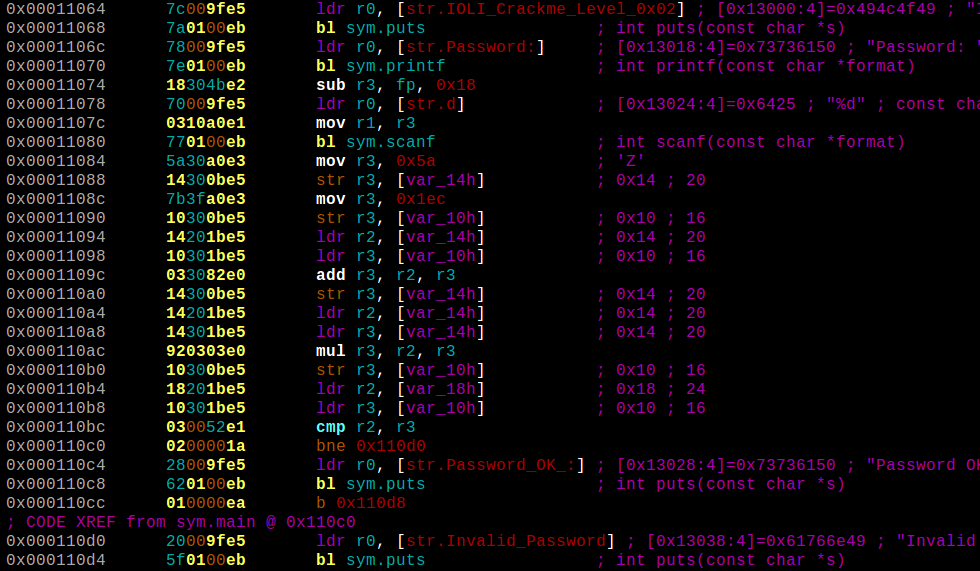
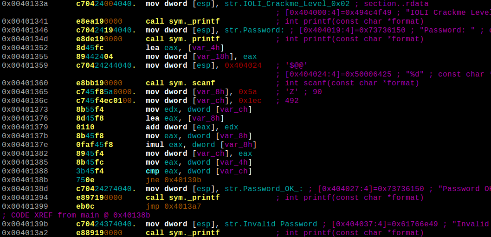

# Background
This is a collection of scripts to solve the password for a simple crackme **IOLI Crackme 0x02** from [GitHub/Maijin/Workshop2015/IOLI-crackme](https://github.com/Maijin/Workshop2015/tree/master/IOLI-crackme). 

As there are Linux (x86), Windows (x86) and PocketPC (ARM) versions of the same crackme, this is a great excuse to try out different tools :wink: and build a personal reference for automating similar RE tasks in the future.

# Static Disassembly

The important bits of the crackme are shown below. The password generation algorithm is identical for all three platforms and can be solved manually from the disassembly but what's the fun in that? :grin:

## Linux

The entered password is read via *scanf()* at *0x08048426* and stored in **var_4h** as an integer. It must match the value in **eax** at *0x08048448* which is calculated by a few mathematical operations between *0x0804842B* and *0x8048444*.

## PocketPC (ARM)

The entered password is read via *scanf()* at *0x00011080* and stored in **var_18h** as an integer. It must match the value in **r3** at *0x000110b8* which is calculated by a few mathematical operations between *0x00011084* and *0x000110b0*.

## Windows

The entered password is read via *scanf()* at *0x00401360* and stored in **var_4h** as an integer. It must match the value in **eax** at *0x00401382* which is calculated by a few mathematical operations between *0x00401365* and *0x0040137e*.

# Methods

1. [Debugging with Radare2 and r2pipe for Linux](r2debug/)
2. [Emulation with Radare2 and r2pipe for ARM](r2emu/)
3. [Debugging with GDB command file for Linux](gdb/)
4. [Debugging with x64dbg script for Windows](x64dbg/)
5. [Solving and simplifying with Z3 for Linux/Windows](z3/)
